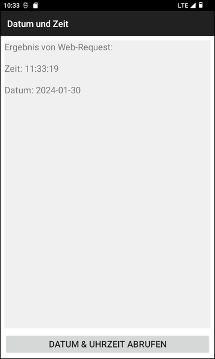
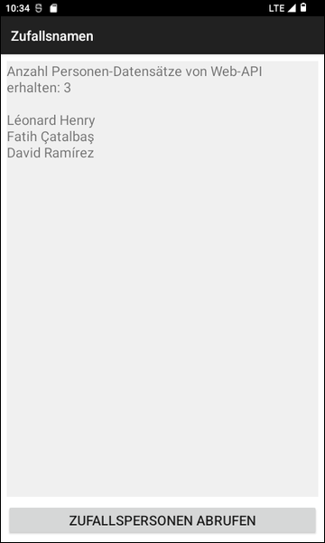

# REST-APIs mit Android-App abfragen #

 

Dieses Repo enthält eine native Android-App mit Java, mit der Daten von drei REST-APIs (Web-APIs) abgefragt werden können:

| Daten | REST-API | Separate App (GitHub-Repo) |
| -- | -- | -- |
| Datum & Uhrzeit | [api.el-decker.de](https://api.el-decker.de/DatumUndZeit.php) | [Link](https://github.com/MDecker-MobileComputing/Android_DatumUndZeitVonWebAPI) |
| Zufallsnamen (Vor- und Nachname) | [randomuser.me](https://randomuser.me/) | [Link](https://github.com/MDecker-MobileComputing/Android_ZufallsnamenVonWebAPI) |
| Bild (Foto von Person) | [randomuser.me/photos](https://randomuser.me/photos) | [Link](https://github.com/MDecker-MobileComputing/Android_ZufallsbilderVonWebAPI) |

 

Die in der Spalte "Separate App" verlinkten Android-Apps werden nicht mehr weiterentwickelt/aktualisiert.

 

----

## Screenshots ##

 

 &nbsp; 

 &nbsp; 

 

----

## License ##

 

See the [LICENSE file](LICENSE.md) for license rights and limitations (BSD 3-Clause License).

 